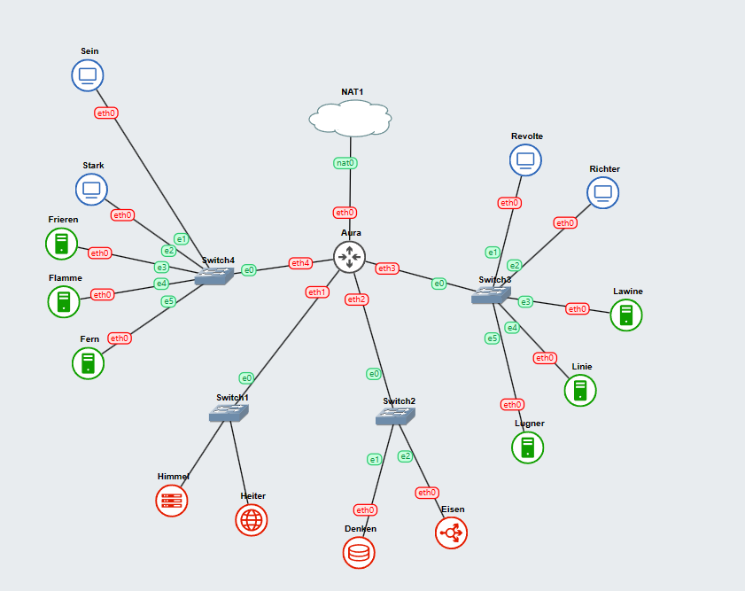
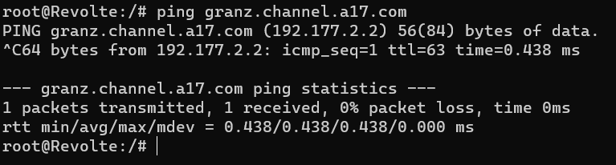
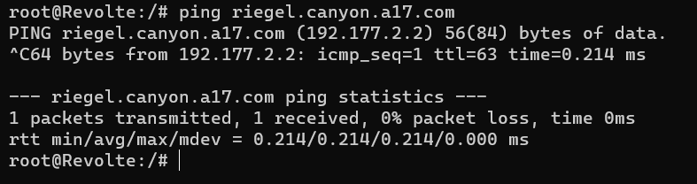
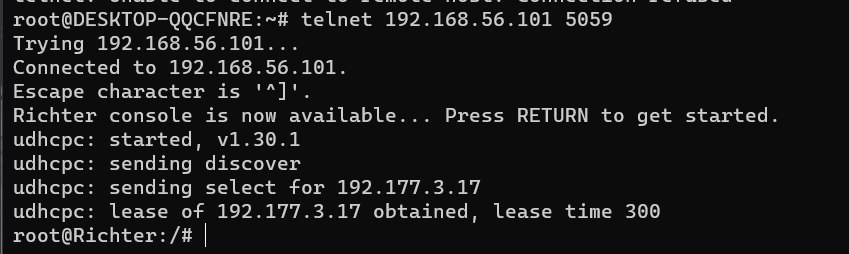
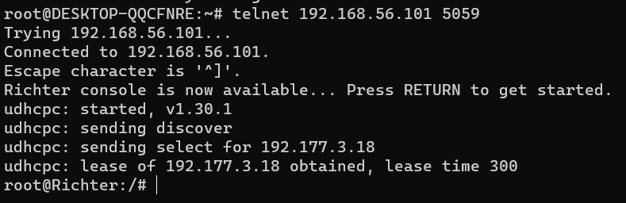

# **Praktikum 3 Jaringan Komputer**
<div align=justify>

Berikut adalah Repository dari Kelompok A17 untuk pengerjaan Praktikum Modul 3 Jaringan Komputer. Dalam Repository ini terdapat Anggota Kelompok, Dokumentasi serta Penjelasan tiap soal, Screenshot Output, dan Kendala yang dialami.

# **Anggota Kelompok**

| Nama                      | NRP        | Kelas                |
| ------------------------- | ---------- | ----------------     |
| Andrian                   | 5025211079 | Jaringan Komputer A  |
| Akmal Ariq Romadhon       | 5025211188 | Jaringan Komputer A  |

# **Dokumentasi dan Penjelasan Soal**
<div align=justify>

Berikut adalah dokumentasi yang berisi source code dari tiap soal dan penjelasan terkait perintah yang digunakan. 

## **Soal Nomor 0 dan 1**
Setelah mengalahkan Demon King, perjalanan berlanjut. Kali ini, kalian diminta untuk melakukan register domain berupa riegel.canyon.yyy.com untuk worker Laravel dan granz.channel.yyy.com untuk worker PHP mengarah pada worker yang memiliki IP [prefix IP].x.1. Lakukan konfigurasi sesuai dengan peta yang sudah diberikan. 

## **Penyelesaian Soal Nomor 0 dan 1**

Konfigurasi Interface setiap node
```bash
#AURA

auto eth0
iface eth0 inet dhcp
up iptables -t nat -A POSTROUTING -o eth0 -j MASQUERADE -s 192.177.0.0/16


auto eth1
iface eth1 inet static
	address 192.177.1.0
	netmask 255.255.255.0

auto eth2
iface eth2 inet static
	address 192.177.2.0
	netmask 255.255.255.0

auto eth3
iface eth3 inet static
	address 192.177.3.0
	netmask 255.255.255.0

auto eth4
iface eth4 inet static
	address 192.177.4.0
	netmask 255.255.255.0


#HIMMEL
auto eth0
iface eth0 inet static
	address 192.177.1.1
	netmask 255.255.255.0
	gateway 192.177.1.0


#HEITER
auto eth0
iface eth0 inet static
	address 192.177.1.2
	netmask 255.255.255.0
        gateway 192.177.1.0


#DENKEN
auto eth0
iface eth0 inet static
	address 192.177.2.1
	netmask 255.255.255.0
	gateway 192.177.2.0

#EISEN
auto eth0
iface eth0 inet static
	address 192.177.2.2
	netmask 255.255.255.0
	gateway 192.177.2.0


## Untuk Worker dan Client menggunakan IP Dinamis
auto eth0
iface eth0 inet dhcp
hwaddress ether ea:5e:ce:cb:22: #Hanya untuk worker
```

Lalu, melakukan konfigurasi DNS seperti biasa pada DNS SERVER.
```
konfigurasi channel.a17.com
;
; BIND data file for local loopback interface
;
$TTL    604800
@       IN      SOA     channel.a17.com. root.channel.a17.com. (
                        2022100601      ; Serial
                         604800         ; Refresh
                          86400         ; Retry
                        2419200         ; Expire
                         604800 )       ; Negative Cache TTL
;
@       IN      NS      channel.a17.com.
@       IN      A       192.177.1.2
granz   IN      A       192.177.3.1 #IP PHP Worker 
@       IN      AAAA    ::1

```
```
konfigurasi canyon.a17.com
;
; BIND data file for local loopback interface
;
$TTL    604800
@       IN      SOA     canyon.a17.com. root.canyon.a17.com. (
                        2022100601      ; Serial
                         604800         ; Refresh
                          86400         ; Retry
                        2419200         ; Expire
                         604800 )       ; Negative Cache TTL
;modu
@       IN      NS      canyon.a17.com.
@       IN      A       192.177.1.2 
riegel  IN      A       192.177.4.1 #IP Laravel Worker
@       IN      AAAA    ::1
```

Menkonfigurasi Domain pada named.local.conf
```
zone "canyon.a17.com" {
        type master;
        file "/etc/bind/jarkom/canyon.a17.com";
};

zone "channel.a17.com" {
        type master;
        file "/etc/bind/jarkom/channel.a17.com";
};
```



## **Soal Nomor 2**
Semua Client harus menggunakan konfigurasi dari DHCP Server. Client yang melalui Switch3 mendapatkan range IP dari [prefix IP].3.16 - [prefix IP].3.32 dan [prefix IP].3.64 - [prefix IP].3.80.


## **Penyelesaian Soal Nomor 2**
Melakukan Konfigurasi pada DHCP Relay dan DHCP Server

```bash
#DHCP RELAY UNTUK PERTAMA KALI

#Konfigurasi pada /etc/default/isc-dhcp-relay .
SERVERS="192.177.1.1"

INTERFACES="eth1 eth2 eth3 eth4"

#Konfigurasi /etc/sysctl.conf .
net.ipv4.ip_forward=1

#DHCP SERVER UNTUK PERTAMA KALI

#Konfigurasi pada file /etc/default/isc-dhcp-server.
INTERFACESv4="eth0"
INTERFACESv6=""

#Konfigurasi pada dhcpd.conf untuk subnet switch 3.
subnet 192.177.3.0 netmask 255.255.255.0 {
    range 192.177.3.16 192.177.3.32;
    range 192.177.3.64 192.177.3.80;
    option routers 192.177.3.0;
    option broadcast-address 192.177.3.255;
    option domain-name-servers 192.177.1.2;
    default-lease-time 180;
    max-lease-time 5760;
}
```


## **Soal Nomor 3**
Client yang melalui Switch4 mendapatkan range IP dari [prefix IP].4.12 - [prefix IP].4.20 dan [prefix IP].4.160 - [prefix IP].4.168.

## **Penyelesaian Soal Nomor 3**
```bash
#Menambahkan konfigurasi pada file /etc/dhcp/dhcpd.conf pada DHCP SERVER .
subnet 192.177.4.0 netmask 255.255.255.0 {
    range 192.177.4.12 192.177.4.32;
    range 192.177.4.160 192.177.4.168;
    option routers 192.177.4.0;
    option broadcast-address 192.177.4.255;
    option domain-name-servers 192.177.1.2;
    default-lease-time 720;
    max-lease-time 5760;
}
```

## **Soal Nomor 4**
Client mendapatkan DNS dari Heiter dan dapat terhubung dengan internet melalui DNS tersebut.

## **Penyelesaian Soal Nomor 4**
```bash
#Menambahkan forwarders pada file konfig /etc/bind/named.conf.options 

options {
        directory "/var/cache/bind";

        forwarders {
                192.168.122.1;
        };

      // dnssec-validation auto;
        allow-query{any;};
        auth-nxdomain no;
        listen-on-v6 { any; };
};
```

## **Soal Nomor 5**
Lama waktu DHCP server meminjamkan alamat IP kepada Client yang melalui Switch3 selama 3 menit sedangkan pada client yang melalui Switch4 selama 12 menit. Dengan waktu maksimal dialokasikan untuk peminjaman alamat IP selama 96 menit.

## **Penyelesaian Soal Nomor 5**
```bash
#Menambahkan konfigurasi ini pada subnet switch 3 
default-lease-time 180;
max-lease-time 5760;

#Menambahkan konfigurasi ini pada subnet switch 4
default-lease-time 720;
max-lease-time 5760;
```
Hasil DHCP





## **Soal Nomor 6**
Berjalannya waktu, petualang diminta untuk melakukan deployment. Pada masing-masing worker PHP, lakukan konfigurasi virtual host untuk website [berikut](https://drive.google.com/file/d/1ViSkRq7SmwZgdK64eRbr5Fm1EGCTPrU1/view) dengan menggunakan php 7.3.

## **Penyelesaian Soal Nomor 6**  

## **Soal Nomor 7**
Kepala suku dari Bredt Region memberikan resource server sebagai berikut: <br>
- Lawine, 4GB, 2vCPU, dan 80 GB SSD.
- Linie, 2GB, 2vCPU, dan 50 GB SSD.
- Lugner 1GB, 1vCPU, dan 25 GB SSD. <br>

aturlah agar Eisen dapat bekerja dengan maksimal, lalu lakukan testing dengan 1000 request dan 100 request/second.

## **Penyelesaian Soal Nomor 7** 

## **Soal Nomor 8**
Karena diminta untuk menuliskan grimoire, buatlah analisis hasil testing dengan 200 request dan 10 request/second masing-masing algoritma Load Balancer dengan ketentuan sebagai berikut: <br>
- Nama Algoritma Load Balancer
- Report hasil testing pada Apache Benchmark
- Grafik request per second untuk masing masing algoritma. 
- Analisis.

## **Penyelesaian Soal Nomor 8**

## **Soal Nomor 9**
Dengan menggunakan algoritma Round Robin, lakukan testing dengan menggunakan 3 worker, 2 worker, dan 1 worker sebanyak 100 request dengan 10 request/second, kemudian tambahkan grafiknya pada grimoire.

## **Penyelesaian Soal Nomor 9** 

## **Soal Nomor 10**
Selanjutnya coba tambahkan konfigurasi autentikasi di LB dengan dengan kombinasi username: “netics” dan password: “ajkyyy”, dengan yyy merupakan kode kelompok. Terakhir simpan file “htpasswd” nya di /etc/nginx/rahasisakita/.

## **Penyelesaian Soal Nomor 10**

## **Soal Nomor 11**
Lalu buat untuk setiap request yang mengandung /its akan di proxy passing menuju halaman https://www.its.ac.id.

## **Penyelesaian Soal Nomor 11**

## **Soal Nomor 12**
Selanjutnya LB ini hanya boleh diakses oleh client dengan IP [Prefix IP].3.69, [Prefix IP].3.70, [Prefix IP].4.167, dan [Prefix IP].4.168.

## **Penyelesaian Soal Nomor 12**

## **Soal Nomor 13**
Karena para petualang kehabisan uang, mereka kembali bekerja untuk mengatur riegel.canyon.yyy.com.
Semua data yang diperlukan, diatur pada Denken dan harus dapat diakses oleh Frieren, Flamme, dan Fern.

## **Penyelesaian Soal Nomor 13**

## **Soal Nomor 14**
Frieren, Flamme, dan Fern memiliki Riegel Channel sesuai dengan quest guide berikut. Jangan lupa melakukan instalasi PHP8.0 dan Composer.

## **Penyelesaian Soal Nomor 14**

## **Soal Nomor 15**
Riegel Channel memiliki beberapa endpoint yang harus ditesting sebanyak 100 request dengan 10 request/second. Tambahkan response dan hasil testing pada grimoire untuk POST /auth/register.

## **Penyelesaian Soal Nomor 15**

## **Soal Nomor 16**
Riegel Channel memiliki beberapa endpoint yang harus ditesting sebanyak 100 request dengan 10 request/second. Tambahkan response dan hasil testing pada grimoire untuk POST /auth/login.

## **Penyelesaian Soal Nomor 16** 

## **Soal Nomor 17**
Riegel Channel memiliki beberapa endpoint yang harus ditesting sebanyak 100 request dengan 10 request/second. Tambahkan response dan hasil testing pada grimoire untuk GET /me.

## **Penyelesaian Soal Nomor 17**

## **Soal Nomor 18**
Untuk memastikan ketiganya bekerja sama secara adil untuk mengatur Riegel Channel maka implementasikan Proxy Bind pada Eisen untuk mengaitkan IP dari Frieren, Flamme, dan Fern.

## **Penyelesaian Soal Nomor 18**

## **Soal Nomor 19**
Untuk meningkatkan performa dari Worker, coba implementasikan PHP-FPM pada Frieren, Flamme, dan Fern. Untuk testing kinerja naikkan 
- pm.max_children
- pm.start_servers
- pm.min_spare_servers
- pm.max_spare_servers
sebanyak tiga percobaan dan lakukan testing sebanyak 100 request dengan 10 request/second kemudian berikan hasil analisisnya pada Grimoire.

## **Penyelesaian Soal Nomor 19** 

## **Soal Nomor 20**
Nampaknya hanya menggunakan PHP-FPM tidak cukup untuk meningkatkan performa dari worker maka implementasikan Least-Conn pada Eisen. Untuk testing kinerja dari worker tersebut dilakukan sebanyak 100 request dengan 10 request/second. 

## **Penyelesaian Soal Nomor 20**

# **Kendala Saat Pengerjaan**

- Website DNS tidak bisa diakses dengan jaringan tertentu, seperti wifi kos. Hal tersebut menghambat pengerjaan karena koneksi dari hotspot tidak selalu stabil
- Terdapat beberapa soal yang ambigu, sehingga ada perubahan disaat sudah menyelesaikannya.
- Koneksi yang tiba-tiba terputus (_Closed by foreign host_) sehingga menghambat pengerjaan.

# **End of The Line**

```c
#include <stdio.h>

int main(){
    printf("Thank you!");
}
```